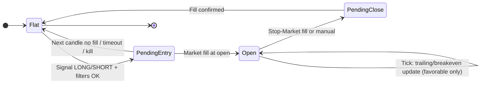
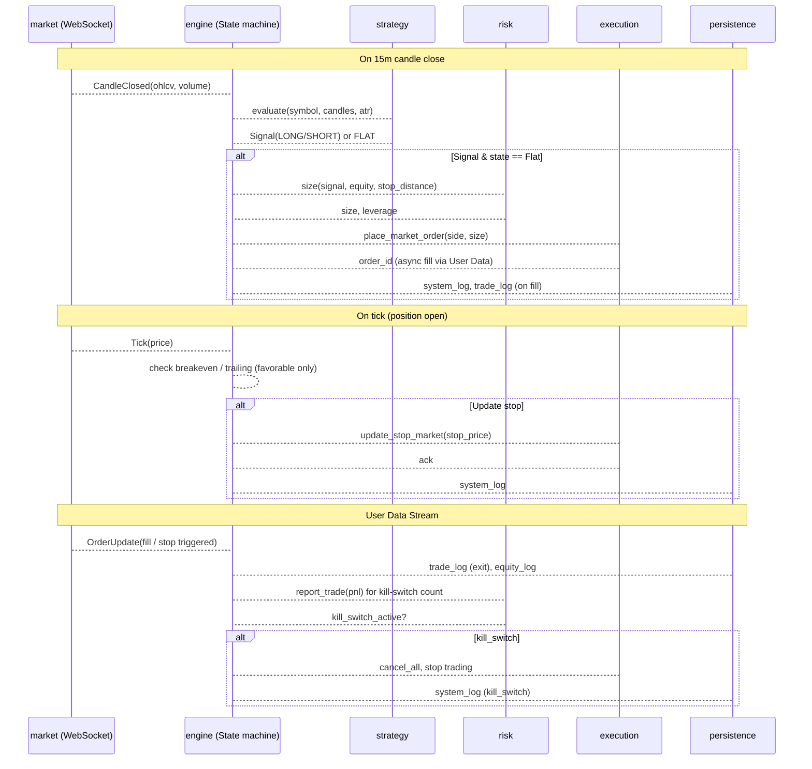

# BFAT 아키텍처 설계

## 1. 프로젝트 폴더 구조

```
BFAT/
├── backend/                    # 트레이딩 엔진 + API
│   ├── app/
│   │   ├── main.py             # FastAPI 진입점, 라우터 등록
│   │   ├── config/             # 설정 (env, 상수, 전략 파라미터)
│   │   ├── core/               # 인프라: DB, 로깅, 예외
│   │   ├── domain/             # 도메인: 포지션, 주문, 시그널, 킬스위치
│   │   ├── strategy/           # 전략 로직 (BB 압축 + 브레이크아웃, 볼륨, 과신장 필터)
│   │   ├── risk/               # 리스크: 사이징, 킬스위치, 일일/연속손실
│   │   ├── execution/          # 주문 실행: Binance REST + Stop-Market, reduceOnly
│   │   ├── market/             # 퍼블릭 WebSocket: 가격, kline, 캔들/ATR 버퍼
│   │   ├── market/user_stream/ # User Data Stream 전담 (listenKey, 주문/포지션 이벤트)
│   │   ├── engine/             # 오케스트레이션
│   │   │   ├── state_machine/  # 순수 상태 전이 + 가드 (부수효과 없음)
│   │   │   └── orchestrator/   # 이벤트 라우팅, strategy/risk/execution/persistence 호출
│   │   ├── persistence/        # DB 접근: trade/equity/system 로그
│   │   └── api/                # HTTP API: 대시보드용 (로그, 통계, 킬스위치)
│   ├── requirements.txt
│   └── .env.example
├── frontend/                   # 웹 대시보드 (기존 React + Vite 유지)
│   └── src/
│       ├── api/                # backend API 클라이언트
│       ├── components/         # 레이아웃, 로그/통계 뷰
│       └── ...
├── migrations/                 # DB 마이그레이션 (SQLite → PostgreSQL 호환 스키마)
├── tests/
│   ├── unit/
│   └── integration/
└── README.md
```

- **backend**: 단일 프로세스 내에서 전략·리스크·실행·DB가 동작. `engine`이 이벤트 소스(캔들 종가, 틱, 주문 업데이트)를 받아 상태기와 연동.
- **frontend**: 기존 [frontend/](frontend/) 구조 활용, `api/`에서 백엔드 로그·통계·킬스위치 API 호출.
- **migrations**: 스키마 버전 관리로 추후 PostgreSQL 전환 시 동일 스키마 재사용.

---

## 2. 모듈 분리 및 책임


| 모듈                     | 경로                        | 책임                                                                                                                                                                                         |
| ---------------------- | ------------------------- | ------------------------------------------------------------------------------------------------------------------------------------------------------------------------------------------ |
| **config**             | `app/config/`             | 환경변수, Binance 키/엔드포인트, 전략 상수(타임프레임 15m, BB lookback 100, 20캔들 고/저, 0.1% 브레이크, 볼륨 1.5x, 2.5 ATR 과신장, 2.5% 리스크, 5x 레버리지, 1.2/1.5 ATR 스탑, 킬스위치 -10% / 6연패). 변경 시 코드 수정 최소화.                   |
| **core**               | `app/core/`               | DB 연결 팩토리(SQLite, 추후 PostgreSQL 스위치 가능), 구조화 로깅, 도메인 예외 타입, 앱 라이프사이클(시작/종료 시 WebSocket·엔진 정리).                                                                                             |
| **domain**             | `app/domain/`             | 포지션/주문/시그널/킬스위치 상태를 나타내는 불변(또는 명확한 규칙의) 데이터 구조. 비즈니스 규칙은 상태기·리스크·전략에 위임.                                                                                                                   |
| **strategy**           | `app/strategy/`           | 15m 캔들 종가 기준: 압축(BB width percentile ≤20%, 100캔들), 브레이크아웃(종가가 20캔들 고/저 ±0.1% 돌파), 볼륨(현재 ≥1.5x 20캔들 평균), 과신장(최근 10캔들 이동 <2.5 ATR). **출력**: LONG/SHORT/FLAT 시그널 + 필요 시 ATR. 로직 변경 금지(고정 스펙). |
| **risk**               | `app/risk/`               | 2.5% 자본 리스크, 5x 레버리지, 스탑 거리 기반 포지션 사이징. 킬스위치: 일일 -10% 도달 시 중단, 6연속 손실 시 중단. 엔진이 “진입/청산 후” 연속손실 카운트를 전달.                                                                                    |
| **execution**          | `app/execution/`          | Binance USDT-M REST: 시장 주문(진입), reduceOnly Stop-Market(스탑). ATR 트레일링은 “스탑 가격만 변경”하는 주문 수정 또는 취소+재설정으로 처리. User Data는 `market/user_stream` 담당. 모든 주문에 **client order id** 부여(멱등성).          |
| **market**             | `app/market/`             | **퍼블릭만**: 가격/틱, 15m kline 스트림. 캔들/ATR 버퍼 또는 context 제공. exchange info 캐시. 재연결 시 지수 백오프 + 재구독.                                                                                              |
| **market/user_stream** | `app/market/user_stream/` | User Data Stream 전담. listenKey 갱신, OrderUpdate/PositionUpdate → 엔진. 끊김 시 재연결 후 REST로 포지션/오픈오더 정합성.                                                                                         |
| **engine**             | `app/engine/`             | **state_machine**: 순수 전이+가드. **orchestrator**: 이벤트→상태기→strategy/risk/execution/persistence 호출. 캔들 버퍼는 market에 위임.                                                                          |
| **persistence**        | `app/persistence/`        | trade_log, equity_log, system_log 테이블에 대한 insert/query. 트랜잭션 경계, connection 관리. 마이그레이션 스크립트는 `migrations/`에서 참조.                                                                           |
| **api**                | `app/api/`                | 대시보드용 REST: 로그 조회(거래/자산/시스템), 요약 통계, 킬스위치 상태/수동 리셋(선택). 인증은 추후 확장.                                                                                                                         |


---

## 3. 포지션 생명주기 상태 기계

단일 포지션 모델: 한 번에 하나의 방향만 허용. “진입 대기”와 “포지션 보유”를 명확히 구분.




- **Flat**: 포지션 없음. 캔들 종가에서 전략 시그널 평가. 시그널 발생 시 사이징 후 **다음 캔들 시가**에 시장 주문.
- **PendingEntry**: 진입 주문 제출됨. **타임아웃**: 다음 15m 캔들 시가 시점 또는 제출 후 90초. 타임아웃 시 미체결 주문 REST 취소 → **Flat**(`reason=entry_timeout`). User Data fill 시 **Open**(`reason=signal_fill`). 킬스위치 시 **Flat**(`reason=kill_switch`).
- **Open**: 포지션 보유. **stop_phase**: `initial_stop`(1.2 ATR) → 1R 도달 시 `breakeven` → 이후 `trailing`(1.5 ATR). 틱마다 “유리할 때만” 스탑 갱신(유리할 때만). reduceOnly Stop-Market으로만 청산. 로깅 시 phase 포함.
- **PendingClose**: 스탑 fill 대기. fill 확인 시 **Flat**, trade/equity 로그, 연속손실 갱신. **보조**: N초 내 fill 미수신 시 REST로 포지션 재조회; 0이면 **Flat** 전이 및 로깅(중복 방지).

**전이 reason** 고정: `signal_fill` | `entry_timeout` | `stop_fill` | `kill_switch` | `reconcile`. 모든 전이에 기록.

상태 전이 시 **system_log**(상태+reason), **trade_log**, **equity_log** 기록.

---

## 4. 데이터 모델 (로그 테이블)

스키마는 SQLite 우선, 타입/제약을 PostgreSQL 호환되게 설계.

**trade_log** (거래 단위)


| 컬럼               | 타입        | 설명                             |
| ---------------- | --------- | ------------------------------ |
| id               | PK, auto  |                                |
| symbol           | TEXT      | 예: BTCUSDT                     |
| side             | TEXT      | LONG / SHORT                   |
| entry_time       | TIMESTAMP | 진입 체결 시각                       |
| entry_price      | REAL      |                                |
| size             | REAL      | 계약/코인 수 (레버리지 반영 후)            |
| exit_time        | TIMESTAMP | 스탑 체결 시각                       |
| exit_price       | REAL      |                                |
| pnl              | REAL      | 실현 손익 (USDT)                   |
| pnl_r            | REAL      | R 배수 (진입 시 스탑 거리 대비)           |
| stop_used        | TEXT      | breakeven / trailing_1_5_atr 등 |
| signal_candle_ts | TIMESTAMP | 시그널 난 15m 캔들 종가 시각             |
| correlation_id   | TEXT      | 한 거래 추적용 ID (시그널→진입→스탑→청산 공통)  |
| metadata         | JSON/TEXT | (선택) ATR, 스탑 거리 등              |


**equity_log** (자산 스냅샷)


| 컬럼                 | 타입        | 설명                       |
| ------------------ | --------- | ------------------------ |
| id                 | PK, auto  |                          |
| ts                 | TIMESTAMP | 기록 시각                    |
| equity             | REAL      | 총 계정 자산 (USDT)           |
| available_balance  | REAL      |                          |
| unrealized_pnl     | REAL      | 미실현 (포지션 있을 때)           |
| daily_start_equity | REAL      | 당일 0시 기준 (킬스위치 -10% 계산용) |


- 기록 주기: 주기적(예: 1분) + 포지션 진입/청산 시점.

**system_log** (이벤트/감사)


| 컬럼             | 타입        | 설명                                                                     |
| -------------- | --------- | ---------------------------------------------------------------------- |
| id             | PK, auto  |                                                                        |
| ts             | TIMESTAMP |                                                                        |
| level          | TEXT      | INFO / WARN / ERROR                                                    |
| event          | TEXT      | state_change / order_submit / order_fill / kill_switch / signal_eval 등 |
| message        | TEXT      |                                                                        |
| payload        | JSON/TEXT | 이벤트별 고정 스키마 (아래 참고)                                                    |
| correlation_id | TEXT      | trade_log와 동일; 한 거래 흐름 추적                                              |


**payload 스키마 예**: `order_submit`: order_id, symbol, side, size, client_order_id | `order_fill`: order_id, fill_price, fill_qty | `stop_update`: old_stop_price, new_stop_price, reason(breakeven|trailing) | `state_change`: old_state, new_state, reason. 스탑 "유리할 때만" 갱신 시마다 stop_update 로깅.

- (선택) **audit_log**: 변경/삭제 없이 append-only 감사용.

---

## 5. 컴포넌트 상호작용 흐름




- **WebSocket(market)**: 캔들 종가 이벤트 + 틱 스트림 + User Data(주문/포지션) 수신 후 엔진에 이벤트만 전달. 엔진이 구독/라우팅.
- **Strategy**: 순수 함수에 가깝게: 캔들/ATR 입력 → 시그널. 엔진이 캔들 버퍼와 ATR 관리.
- **Risk**: 사이징 + 킬스위치(일일 -10%, 6연패). 엔진이 청산 시 pnl/equity 전달해 연속손실·일일 수익률 갱신.
- **Execution**: Binance REST 호출, reduceOnly Stop-Market 주문/수정. 실패 시 재시도/에러는 엔진에 반환해 system_log 및 상태 복구.
- **Persistence**: 엔진/API에서 “기록해 달라”는 요청만 받고, 트랜잭션과 스키마 버전은 core + migrations에서 관리. **기동 시**: REST로 positionRisk/openOrders 조회 후 상태기 부트스트랩(거래소 기준).

---

## 6. 프로덕션·확장성 요약

- **결정론**: 캔들 종가로만 시그널 → 다음 캔들 시가 진입. 백테스트와 라이브의 “시그널 타이밍”을 동일하게 맞출 수 있음.
- **리스크**: 포지션 크기는 스탑 거리와 2.5% 리스크로만 산출. 레버리지 5x 고정.
- **스탑**: reduceOnly Stop-Market으로 청산만 수행. 트레일링은 서버 측 주문 수정으로 “유리할 때만” 갱신해 스탑 낙오 최소화.
- **단일 포지션**: 상태기가 한 방향만 허용해 겹치는 거래 제거.
- **DB**: SQLite로 시작, persistence를 추상화(연결/커서 인터페이스)해 두면 migrations와 스키마를 PostgreSQL에 맞춰 전환 가능.
- **대시보드**: API로 trade/equity/system 로그와 통계만 제공. 실시간은 폴링 또는 추후 WebSocket 푸시로 확장.

전략 로직(압축/브레이크아웃/볼륨/과신장/스탑 규칙)은 고정 스펙으로 두고, **config** 값과 **모듈 경계**만으로 조정 가능한 구조로 두는 것이 목표이다.

---

## 7. 아키텍처 리뷰 및 보강

### Critical Issues (해소 방향)

- **Engine God Object 위험**: state_machine(순수 전이+가드)과 orchestrator(이벤트→호출)로 분리해 책임 축소. 캔들/ATR 버퍼는 market 또는 context 모듈로 이전.
- **재기동 시 주문/포지션 불일치**: 기동 시 항상 REST로 `positionRisk`, `openOrders` 조회 후 상태기 부트스트랩. 거래소를 Source of Truth로 사용.
- **User Data Stream 소유**: `market/user_stream` 전담 모듈로 listenKey 갱신·재연결·이벤트 전달 책임 명확화.
- **PendingEntry 타임아웃**: 위 상태기 보강에서 명시(다음 캔들 시가 또는 90초 + 취소 → Flat).
- **스탑 갱신 Rate Limit**: 아래 Stability의 “스탑 갱신 쓰로틀”로 대응.

### Structural Improvements

- **엔진 분리**: 상태기(부수효과 없음) vs 오케스트레이터(외부 모듈 호출). 테스트·재사용 용이.
- **캔들/ATR 버퍼**: market 또는 전용 context가 보관; strategy/engine는 “준비된 시계열+ATR”만 입력받음.
- **User Data 전담**: market = 퍼블릭만, user_stream = listenKey + OrderUpdate/PositionUpdate → 엔진.
- **Persistence 계약**: “무엇을 로깅할지”는 persistence/로깅 파사드가 이벤트 스키마로 정의. 엔진은 도메인 이벤트만 발생.

### Stability Improvements

- **WebSocket 재연결**: 퍼블릭 스트림 지수 백오프 + 재구독. User Data 끊기면 재연결 후 **REST로 포지션/오픈오더 조회** → 로컬 상태와 정합성 맞춤(거래소 우선). listenKey 주기적 갱신.
- **재기동 정합성**: 기동 시 REST로 포지션/오픈오더 조회 → 상태기 초기 상태 부트스트랩. 선택: 중요 전이마다 last_known_state를 DB에 저장 후 재기동 시 DB 복원 + REST로 1회 정합.
- **스탑 갱신 Rate Limit 대응**: (1) **최소 이동 임계값**: 스탑 가격이 N틱 또는 0.1% 이상 변할 때만 수정. (2) **쓰로틀**: 분당 최대 K회 등. (3) 429 시 지수 백오프 재시도. (4) 선택: 짧은 디바운스(1–2초) 후 최신 가격 기준 1회만 수정.

### State Machine Refinements (반영됨)

- PendingEntry 타임아웃 및 취소 → Flat.
- Open 내 **stop_phase**: initial_stop | breakeven | trailing.
- PendingClose 보조 경로: N초 내 fill 미수신 시 REST 재조회 → Flat + 로깅(중복 방지).
- 모든 전이에 **reason** 기록.

### Production Hardening

- **거래소 보호**: 스탑은 항상 reduceOnly. 모든 주문에 **client order id** (멱등성).
- **Circuit breaker**: execution 연속 실패 시 새 주문 중단, system_log ERROR, 수동/명시적 리셋 후 재개.
- **Graceful shutdown**: SIGTERM 시 새 시그널 중단, PendingEntry면 취소 또는 타임아웃 대기, Open이면 스탑은 거래소에 맡기고 상태 저장 후 종료.
- **헬스 고도화**: 엔진 상태 + 마지막 이벤트 시각 + 퍼블릭/User Data WS 연결 여부를 `/health` 또는 전용 엔드포인트에 포함.

### Logging Granularity (반영됨)

- **correlation_id**: 시그널 평가 → 진입 제출 → fill → 스탑 제출/수정 → 청산 fill까지 동일 ID로 추적.
- **이벤트별 payload 스키마**: order_submit, order_fill, stop_update, state_change 등 고정.
- 스탑 “유리할 때만” 갱신 시마다 **stop_update** 로깅(old/new 가격, reason).
- (선택) **audit_log** 테이블: append-only, 변경/삭제 없음.

### Optional Enhancements

- **Outbox 패턴**: 중요 로그를 로컬 outbox에 먼저 기록 후 비동기 flush. 크래시 시 재기동 후 재생.
- **API와 엔진 프로세스 분리**: 엔진 크래시 시에도 대시보드/API 유지. 엔진만 재시작 후 REST 정합.
- **메트릭**: 시그널 수, 주문/체결 수, 상태 전이, 체결 지연 분포 등을 `/metrics`(Prometheus 등)로 노출.
- **daily_start_equity**: 자정에 명시적 갱신 규칙을 config/엔진에 정의해 킬스위치 -10% 기준 일관화.